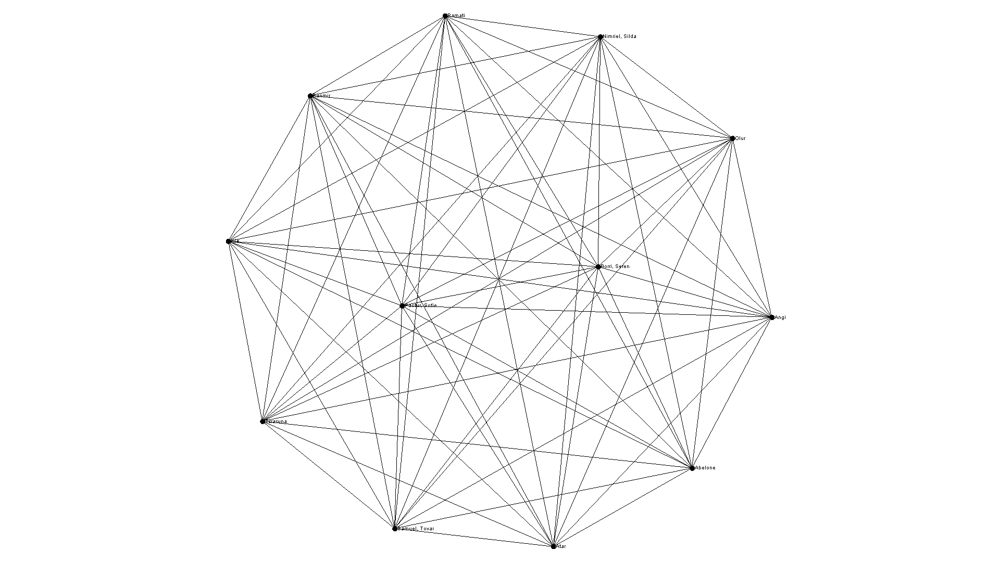
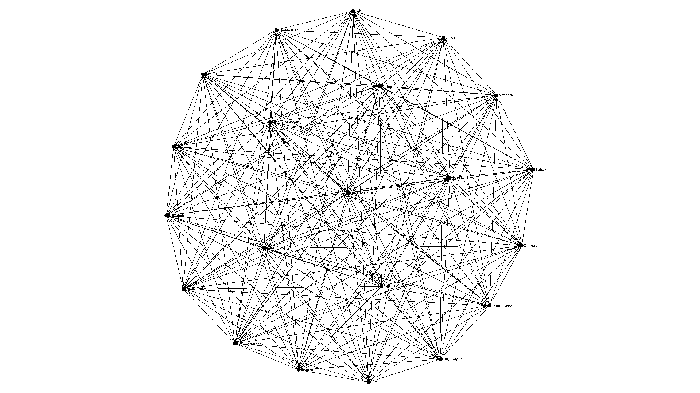
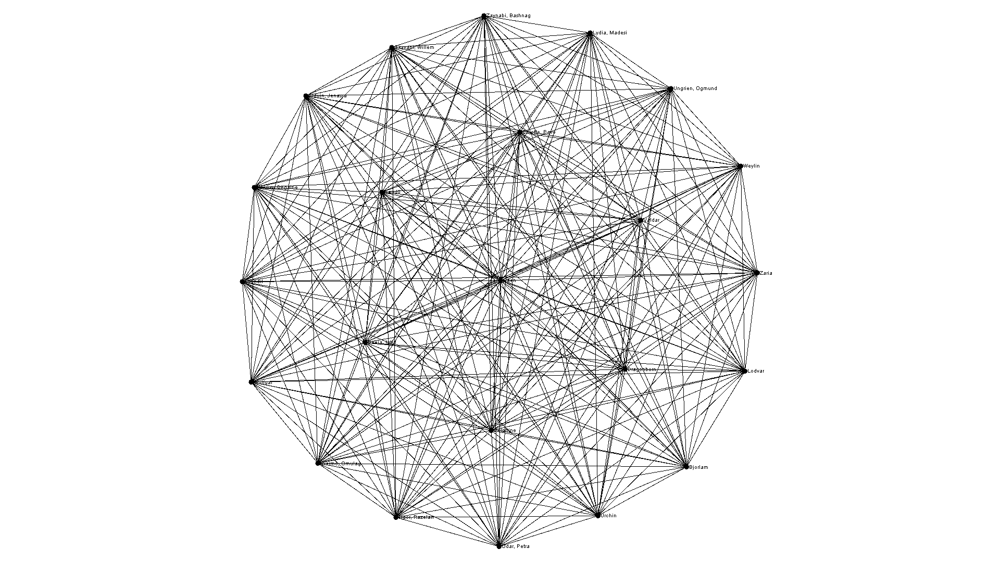

# Skyrim Small Groups 
A work by: Mathew Lister and Tad Okazaki

Install Tutorial: https://youtu.be/4P2uYK9tS8I

## Introduction
The people of Skyrim wish to spread COVID-19 as fast as possible. The devise a plan to have miniature house parties so that everyone visits everyone else’s house as fast as possible based on a constant party size. Skyrim takes marriage very seriously (you receive 100 gold and a cooked meal everyday) so, married couples must go to the same party every time and count as two towards the party size.

## Description 
This program reads in a list of names ***(n)*** with the desired group size/size of the party ***(g)***. One person in that group will be designated as the party host and everyone else will be visitors. This program will initialize graphs to represent every possible group such that everyone in the list visits everyone else’s house for a party. There will also be a corresponding hash table that will grow as the program runs. We wrote out program using Java and used the Graphstream API. 

The following is a list of steps taken to initialize our algorithm 

1.	Read file to get group size
2.	Read file and store names in a list
3.	Calculate the number of groups (total amount of people / group size)
4.	Calculate the number of people that will be overflow (total amount of people % group size)
5.	Calculate the number of visitors that will signify program completion (total amount of people * (total amount of people – 1))

The following is a list of steps taken in our algorithm until (total amount of visitors for every host == (total amount of people * (total amount of people – 1)))

1.	Select a random person from the list (host)
2.	Loop through list of people 
	1.	If this person has not already visited host
	2.	If this person is not already going to a party
	3.	If this person can fit in the group – add them 
		1.	Else the person does not fit go back to step 2.i with the next person
	4.	Add this person to the host (connect the two on a graph, add as key value pair into table if does not already 	exist)
	5.	If we can still have more hosts go back to step 1
		1.	Else move to step 3 
3.	Now we have all our overflow people gathered here
	1.	Loop through the list of current hosts 
	2.	If the current person in overflow can fit into the group
	3.	If the current person in overflow has not already visited host
		1.	Else go back to step 3.i
	4.	Add this person to the host (connect the two on a graph, add as key value pair into table if does not already 	exist)
	5.	If there are still people left in overflow after trying to add them to a group go to step 4
4.	Now we have all our super overflow people gathered here
	1.	Go group by group and append these people one by one (they don’t fit anywhere so we must do this)

The time complexity of our algorithm: ***O(3gn + n + n2)***

From our observations, on average this algorithm finds all the groups in n2 iterations. 

***Note: Source code (DriverCode.java) is annotated with comments beginning with “TIME COMPLEXITY: ” that signify where the time complexity calculation is coming from.***  

## Requirements 
* Java 11.0.4 https://www.oracle.com/java/technologies/javase/jdk11-archive-downloads.html
* Graph stream API http://graphstream-project.org/download/
	* Helpful Documentation https://data.graphstream-project.org/api/gs-core/current/org/graphstream/graph/Graph.html
* Intellij IDEA https://www.jetbrains.com/idea/
## User Manual

***Because this application uses JavaFX to create the dynamic graphs we are not able to properly package the application into a JAR.
Multiple attemps have been made and we did extensive research into the errors we recieved when trying to run the JAR. The Graphstream libraries are throwing security flags when trying to run the JAR. This is unfortunate and with more time maybe we could figure it out. However, if you clone this repo all dependencies will come with it. We strongly reccomend downloading Intellij and running our project inside the IDE***

Install Tutorial: https://youtu.be/4P2uYK9tS8I

Install Steps:
1. Clone repo: https://github.com/csc3430-winter2020/community-small-groups-dagobah.git
2. Open the GRAPHS folder in Intellij (X:\*Cloned location\community-small-groups-dagobah\GRAPHS)
	1. May need to add project configuration (next to build icon click "ADD CONFIGURATION"
	2. Click '+'
	3. Click "Application"
	4. Name it "DriverCode"
	5. In "Main CLass" click "..." click "com.company.DriverCode"
	6. Click "Apply"
	7. Click '+'
	8. Click "Application"
	9. Name it "Person"
	10. In "Main CLass" click "..." click "com.company.Person"
	6. Click "Apply"
3. Build the project 
4. Run DriverCode
3. Enter a number corresponding to the desierd menu option and press enter

4. A picture of the graph of groups is taken during each iteration located at (X:\*Cloned location\community-small-groups-dagobah\GRAPHS)
5. You can view each iteration and reference the table view presented in the output window of Intellij

7. A version of the master graph will also be displayed (This is the clique representing everyone seeing everyone)

## 16 people

## 29 people

## 34 people 

## Reflection
Building this program posed many challenges. This was our first time using the graph data structure and the first time really using an outside API for a data structure. Learning how to properly use the API took some time researching and reading the documentation. This was also our first time trying to make a greedy algorithm from scratch. We took a greedy approach because whenever possible, only match a visitor with a host if they have not yet done so before (local optimum) working towards the least amount of iterations (global optimum). Of course, the current pandemic posed an interesting challenge that we overcame by working together on discord. This program was especially difficult because of all the possible conditions and edge cases to consider when building the groups for each iteration. We slowly worked our way to a solution by lots of debugging and print statements. 
